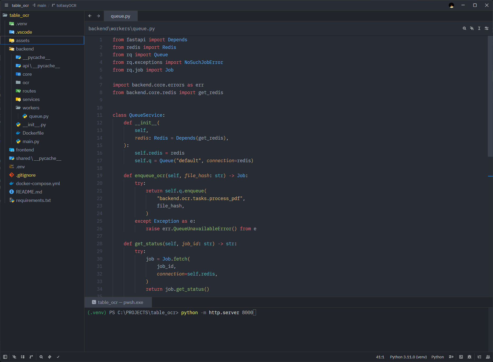

# zed-one-monokai
Originally based on vscode-one-monokai by azemoh.
Ported to Zed by YOUR_NAME.

Original project:
https://github.com/azemoh/vscode-one-monokai

To match keys in the json file of the theme, 2 tools were used:
- VSCode: `Developer: Inspect Editor Tokens and Scopes`
- Zed: `dev: open highlights tree view`

## Thanks to:  
#### enBonnet  
[For the wonderful json key mapping table between the vscode and ZED styles.](https://github.com/enBonnet/migrazed/blob/main/docs/crossover.md)  

#### ypatel2022  
[Thanks for the wonderful mechanism by which I almost completely transferred the theme from vs code to zed](https://github.com/ypatel2022/vscode-theme-to-zed)  

---

